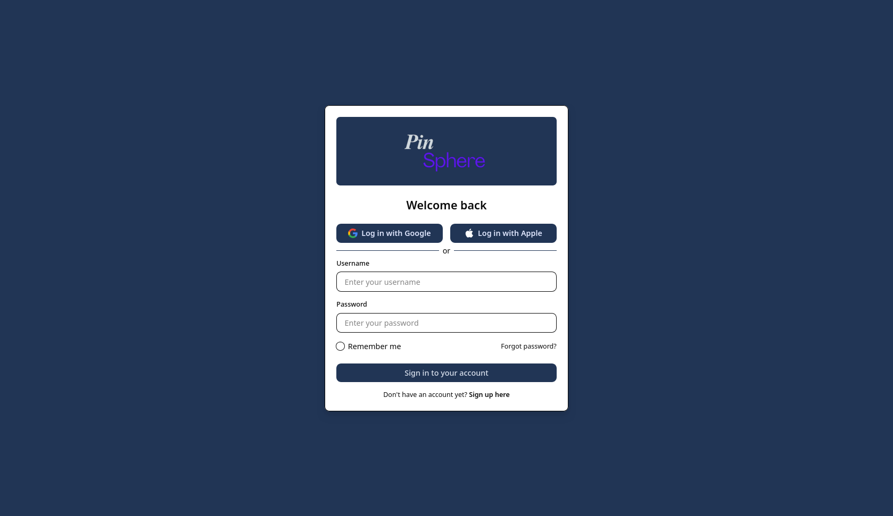
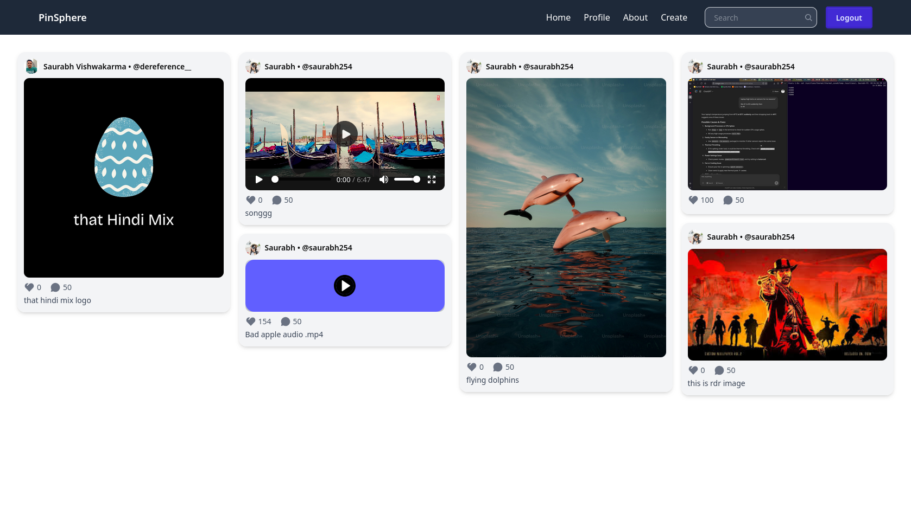
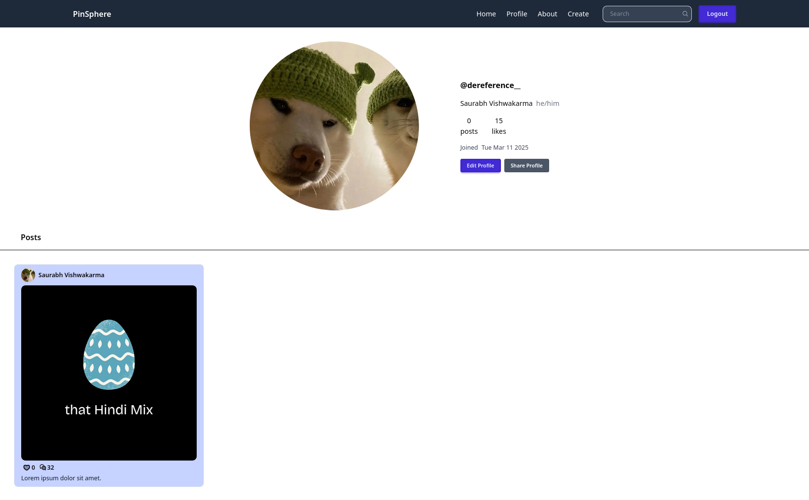
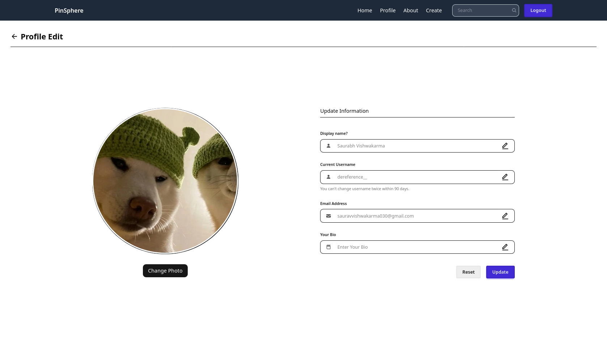
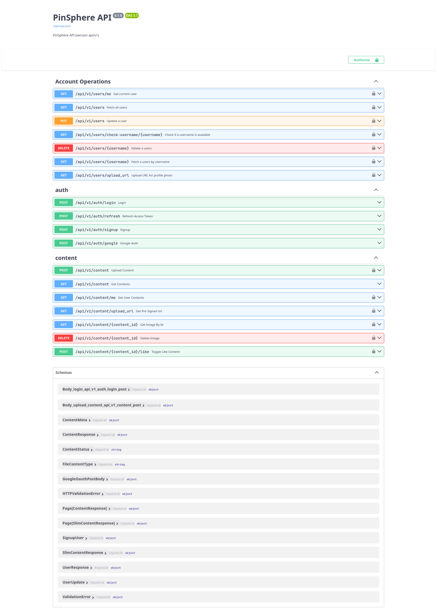

# Pinsphere

**Pinsphere** is a modern, robust, and flexible platform designed to manage, organize, and share visual content like images and media files. Whether you are building a content-sharing platform or simply need a digital archive for your media, Pinsphere provides the tools to efficiently store, retrieve, and organize your content.

---
### ScreenShots

| Image 1 | Image 2 |
|---------|---------|
|  |  |
|  |  |
|| |

---

## Run PinSphere on local machine.

- backend installation guide
    [backend docs](/server/README.md)

- Frontend installation guide
    [frontend docs](/webapp/README.md)
---
