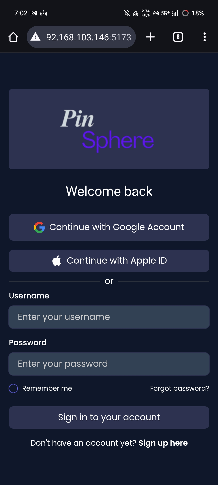
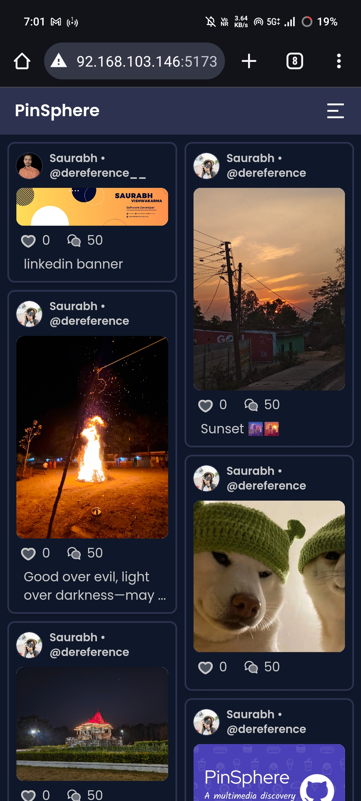
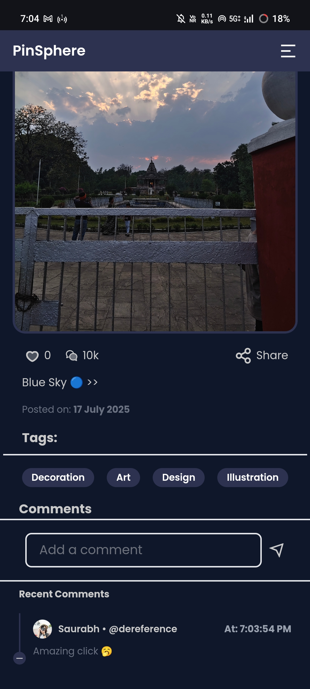
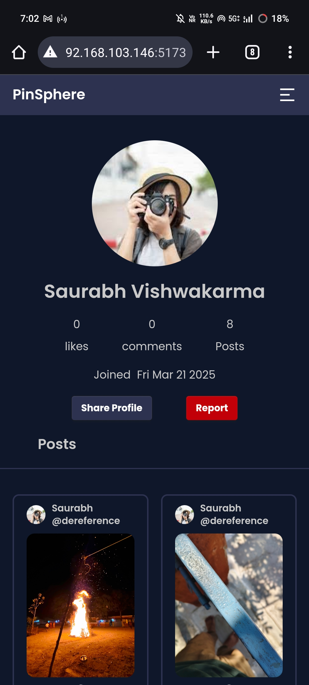
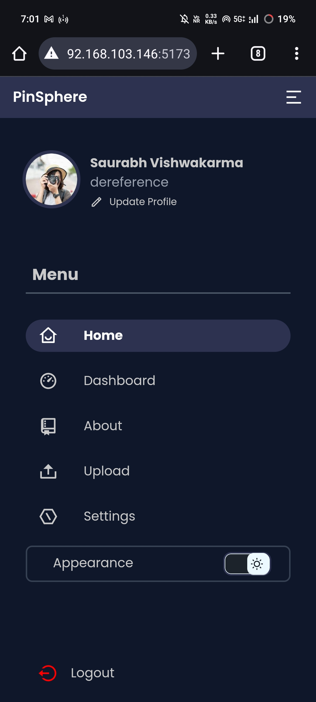

# Pinsphere

**Pinsphere** is a modern, robust, and flexible platform designed to manage, organize, and share visual content like images and media files. Whether you are building a content-sharing platform or simply need a digital archive for your media, Pinsphere provides the tools to efficiently store, retrieve, and organize your content.

---
### ScreenShots

<table>
  <tr>
    <th>Desktop View</th>
    <th>Mobile View</th>
  </tr>
  <tr>
    <td></td>
    <td></td>
  </tr>
  <tr>
    <td></td>
    <td></td>
  </tr>
  <tr>
    <td></td>
    <td></td>
  </tr>
  <tr>
    <td></td>
    <td></td>
  </tr>
  <tr>
    <td></td>
    <td></td>
  </tr>
</table>

---

## Run PinSphere on local machine.

- backend installation guide
    [backend docs](/server/README.md)

- Frontend installation guide
    [frontend docs](/webapp/README.md)
---
