<div align="center">

# 📌 PinSphere

**A high-performance, AI-driven visual discovery and media sharing platform.**  
*Engineered with a distributed asynchronous backend, semantic vector search, direct-to-storage streaming, and a responsive modern frontend.*

---

[](https://www.python.org/)
[](https://fastapi.tiangolo.com/)
[](https://react.dev/)
[](https://www.typescriptlang.org/)
[](https://tailwindcss.com/)
[](https://github.com/pgvector/pgvector)
[](https://docs.celeryq.dev/)
[](https://redis.io/)
[](https://www.docker.com/)
[](https://github.com/saurabh254/PinSphere)

</div>

---

## 📖 Executive Summary

**PinSphere** is a full-stack media curation and discovery platform inspired by Pinterest. Designed from the ground up to handle visual assets efficiently, PinSphere pairs a fluid, responsive client interface with a decoupled, event-driven backend.

Beyond traditional media sharing, PinSphere incorporates **local multimodal AI (Ollama + Gemma 3 4B)** and **vector embeddings (`pgvector`)** to deliver natural-language semantic search across images—allowing users to search for content based on visual context, atmosphere, and descriptive concepts rather than just static hashtags.

> [!NOTE]
> **Repository Context:** This is an independent, proprietary project showcasing end-to-end full-stack architecture, systems design, AI integration, and production-grade software engineering practices.

---

## 🏛️ System Architecture

PinSphere implements a decoupled, event-driven architecture optimized for low API latency, scalable media ingestion, and zero server I/O bottlenecks.

### High-Level Architecture Diagram
<div align="center">
  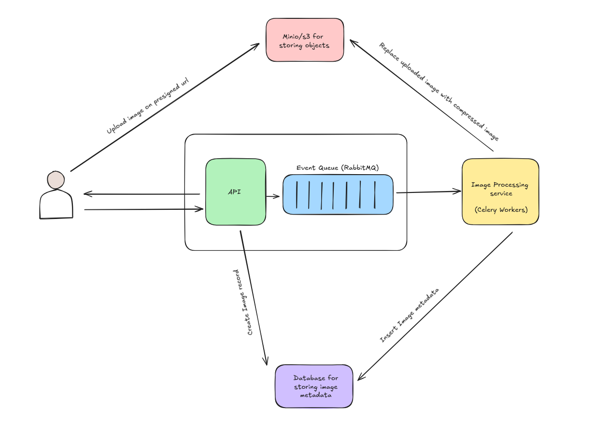
</div>

<br/>

### Data Flow & Component Interaction

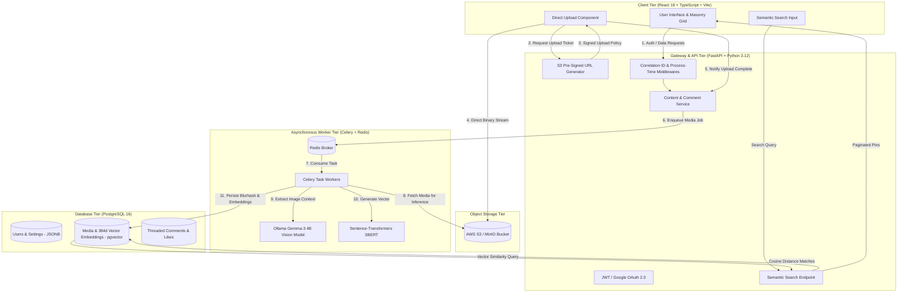
```mermaid
flowchart TD
    subgraph Client ["Client Tier (React 18 + TypeScript + Vite)"]
        UI[User Interface & Masonry Grid]
        Dropzone[Direct Upload Component]
        SearchUI[Semantic Search Input]
    end

    subgraph API ["Gateway & API Tier (FastAPI + Python 3.12)"]
        Auth[JWT / Google OAuth 2.0]
        Presigned[S3 Pre-Signed URL Generator]
        ContentAPI[Content & Comment Service]
        SearchAPI[Semantic Search Endpoint]
        Middleware[Correlation ID & Process-Time Middlewares]
    end

    subgraph Storage ["Object Storage Tier"]
        S3[(AWS S3 / MinIO Bucket)]
    end

    subgraph Async ["Asynchronous Worker Tier (Celery + Redis)"]
        Broker[(Redis Broker)]
        Worker[Celery Task Workers]
        VisionAI[Ollama Gemma-3 4B Vision Model]
        EmbeddingModel[Sentence-Transformers SBERT]
    end

    subgraph DB ["Database Tier (PostgreSQL 16)"]
        PGUsers[(Users & Settings - JSONB)]
        PGVector[(Media & 384d Vector Embeddings - pgvector)]
        PGComments[(Threaded Comments & Likes)]
    end

    %% Client flows
    UI -->|1. Auth / Data Requests| Middleware
    Middleware --> ContentAPI
    Dropzone -->|2. Request Upload Ticket| Presigned
    Presigned -->|3. Signed Upload Policy| Dropzone
    Dropzone -->|4. Direct Binary Stream| S3
    Dropzone -->|5. Notify Upload Complete| ContentAPI

    %% Backend flows
    ContentAPI -->|6. Enqueue Media Job| Broker
    Broker -->|7. Consume Task| Worker
    Worker -->|8. Fetch Media for Inference| S3
    Worker -->|9. Extract Image Context| VisionAI
    Worker -->|10. Generate Vector| EmbeddingModel
    Worker -->|11. Persist Blurhash & Embeddings| PGVector

    %% Search flows
    SearchUI -->|Search Query| SearchAPI
    SearchAPI -->|Vector Similarity Query| PGVector
    PGVector -->|Cosine Distance Matches| SearchAPI
    SearchAPI -->|Paginated Pins| UI
```

---

## 💡 Key Engineering Highlights & Architectural Decisions

### 1. Direct-to-Storage Upload Pattern (Zero Server I/O Bottlenecks)
Instead of streaming heavy image/video payloads through the FastAPI application server, PinSphere utilizes **S3/MinIO pre-signed POST URLs**. The client negotiates an authorized upload ticket with the API and pushes raw binaries directly to object storage. This ensures backend CPU and memory remain available for high-concurrency API traffic.

### 2. Multimodal AI Vision & Semantic Search Pipeline
Traditional media platforms rely entirely on user-provided hashtags for search. PinSphere automates semantic indexing:
- **Vision Inference**: When an image is uploaded, background Celery workers run a multimodal vision model (**Ollama Gemma 3:4B**) to inspect the image and generate dense descriptive summaries.
- **Embedding Generation**: Descriptions are encoded into dense 384-dimensional vector embeddings using `sentence-transformers` (`all-MiniLM-L6-v2`).
- **Vector Search with `pgvector`**: Embeddings are stored natively in PostgreSQL. When users search using free-form natural language (e.g. *"aesthetic rainy cafe"* or *"retro neon arcade"*), the backend performs cosine distance nearest-neighbor queries (`Content.embedding.cosine_distance`) combined with Sentence-BERT similarity ranking.

### 3. Progressive Media Rendering with Blurhash (CLS Optimization)
To ensure optimal performance and eliminate **Cumulative Layout Shift (CLS)**, asynchronous workers calculate a **Blurhash string** upon ingestion. The React client immediately renders a lightweight, low-memory canvas placeholder while high-resolution media downloads asynchronously, guaranteeing a smooth Pinterest-style discovery experience.

### 4. Enterprise Observability & Production Readiness
- **End-to-End Distributed Tracing**: Integrated `asgi-correlation-id` injects a unique Correlation ID per request across logs, database queries, and async tasks.
- **Performance Profiling**: Middleware computes and returns `X-Process-Time` headers on every response.
- **Structured JSON Logging**: Standardized logs via `structlog` and `python-json-logger` for painless integration with log aggregators (Datadog, Grafana Loki, ELK).
- **Strict Static Typing**: Enforced `Pyright` in strict mode on the backend and `TypeScript` on the frontend, catching potential edge cases at compile time.

---

## 📱 Visual Showcase & User Experience

PinSphere is fully responsive, supporting desktop and mobile viewports with fluid masonry layouts, dark/light themes, and real-time feedback.

<div style="overflow-x:auto;">
<table width="100%">
  <thead>
    <tr>
      <th width="65%">Desktop View</th>
      <th width="35%">Mobile View</th>
    </tr>
  </thead>
  <tbody>
    <tr>
      <td colspan="2"><strong>1. Discovery Feed & Dynamic Masonry Grid</strong></td>
    </tr>
    <tr>
      <td>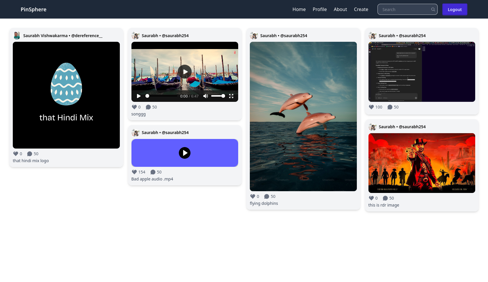</td>
      <td>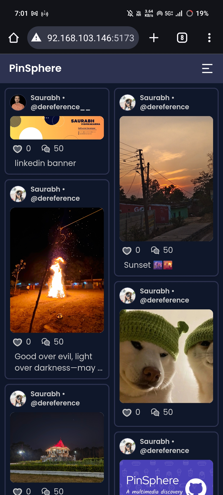</td>
    </tr>
    <tr>
      <td colspan="2"><strong>2. Media Inspection, Engagement & Threaded Comments</strong></td>
    </tr>
    <tr>
      <td>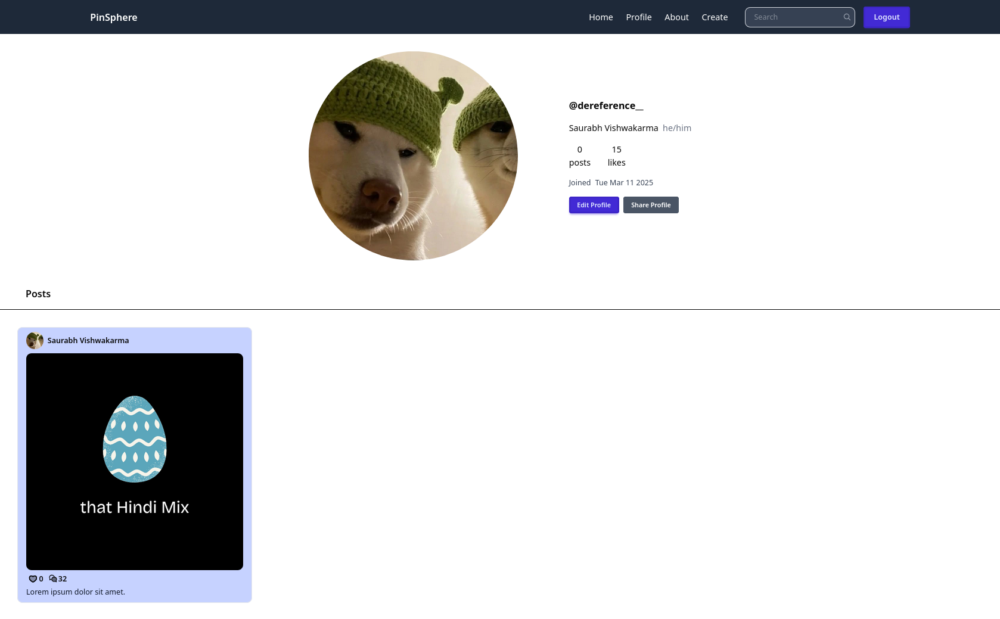</td>
      <td>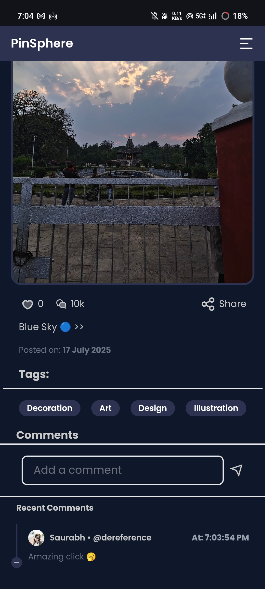</td>
    </tr>
    <tr>
      <td colspan="2"><strong>3. Frictionless Media Creation & Direct Upload</strong></td>
    </tr>
    <tr>
      <td>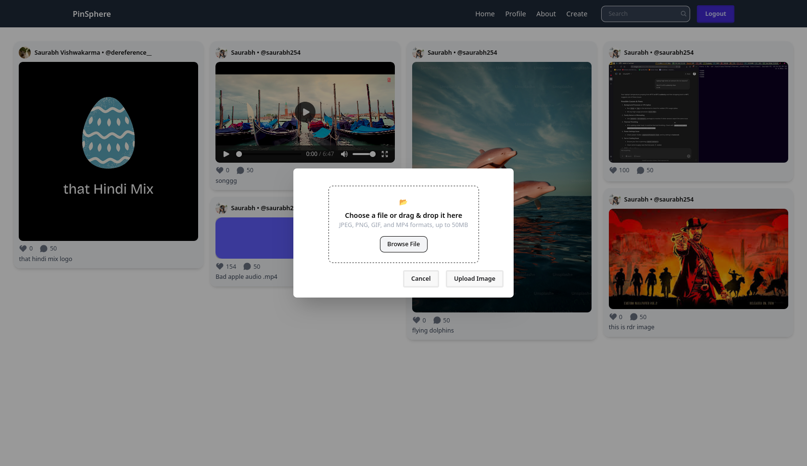</td>
      <td>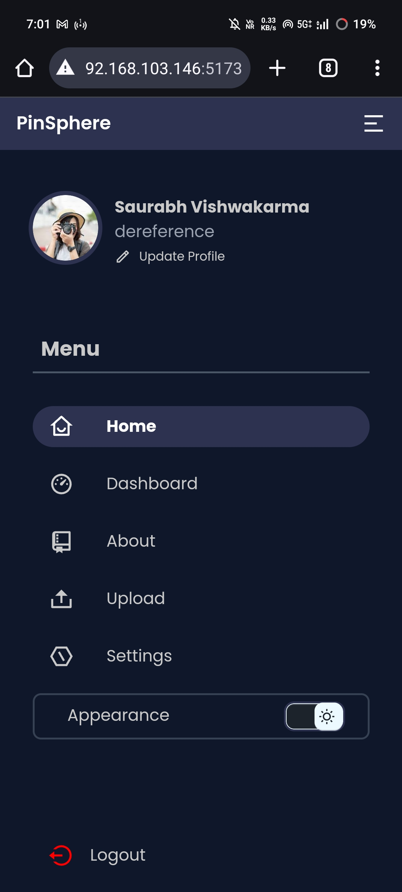</td>
    </tr>
    <tr>
      <td colspan="2"><strong>4. User Profile & Customizable Account Settings</strong></td>
    </tr>
    <tr>
      <td>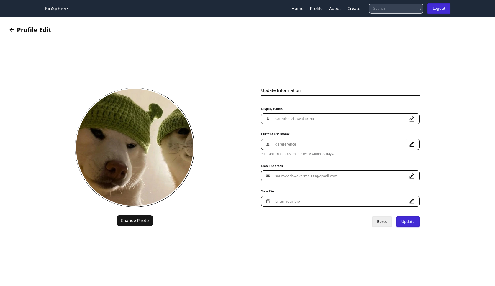</td>
      <td>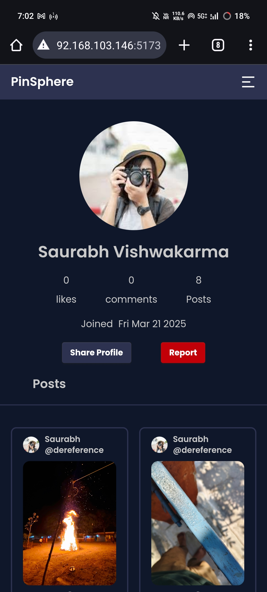</td>
    </tr>
    <tr>
      <td colspan="2"><strong>5. Authentication & Onboarding (Google OAuth 2.0 + Local)</strong></td>
    </tr>
    <tr>
      <td>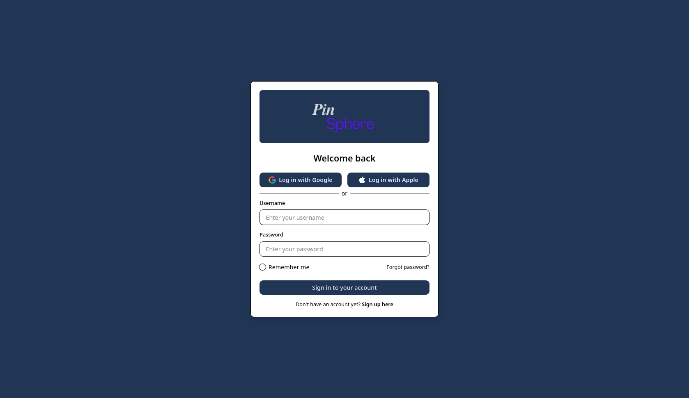</td>
      <td>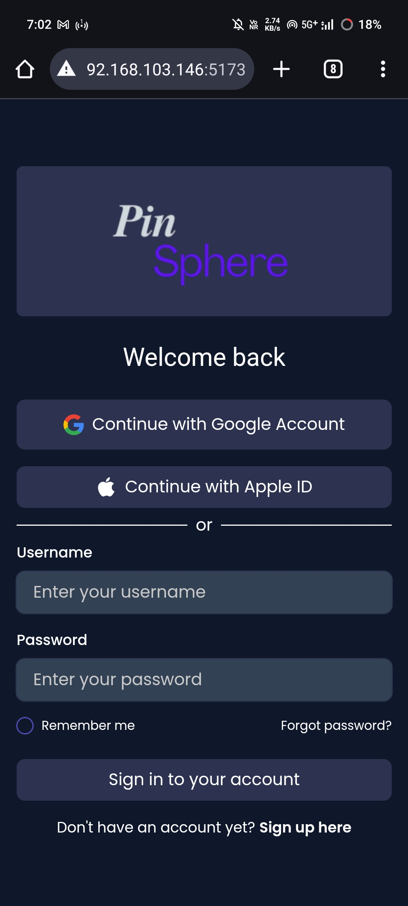</td>
    </tr>
  </tbody>
</table>
</div>

---

## ⚡ Feature Matrix

| Domain | Capabilities |
| :--- | :--- |
| **Media Engine** | Supports Images (PNG, JPEG, GIF), Audio, and Videos with dedicated players (`react-player`, `react-audio-player`). |
| **AI & Search** | Local multimodal image captioning (Ollama), vector embeddings, and cosine similarity semantic search with Sentence-BERT. |
| **Performance** | Progressive Blurhash image placeholders (zero CLS), pre-signed URL direct S3 uploads, and async Celery task queues. |
| **Social Layer** | Threaded / hierarchical comment trees with cascading deletions, like/unlike toggling, and creator attribution. |
| **Auth & Security** | Google OAuth 2.0 integration, standard JWT bearer authentication, salted bcrypt password hashing, and CORS/CSRF protections. |
| **User Experience** | Masonry layout, infinite scroll pagination (`fastapi-pagination`), dark/light theme switching, and responsive mobile drawers. |

---

## 🛠️ Technology Stack

| Layer | Technologies |
| :--- | :--- |
| **Frontend** | React 18, TypeScript, Vite 6, Tailwind CSS v4, DaisyUI, React Router v7, Remix Icons, Lucide Icons, React Blurhash |
| **Backend** | Python 3.12, FastAPI, SQLAlchemy 2.0 (Async), Pydantic v2, Alembic, Uvicorn |
| **AI & ML** | Ollama (Gemma 3:4B Vision), Sentence-Transformers (`all-MiniLM-L6-v2`), PyTorch, pgvector |
| **Data & Storage** | PostgreSQL 16 (`pgvector` + `JSONB`), Redis 7, AWS S3 / MinIO Object Storage |
| **Task Queue** | Celery, Redis Broker, Flower Monitoring |
| **Observability** | Structlog, Python JSON Logger, ASGI Correlation ID, Process-Time Middleware |
| **Tooling & CI** | Docker & Docker Compose, Astral `uv`, Pyright (Strict), Ruff, ESLint, GitHub Actions |

---

## 📄 API Documentation & Standards

PinSphere is built following **RESTful conventions** with automatic **OpenAPI 3.1** specification generation. An interactive Swagger UI is available at `/docs` and ReDoc at `/redoc`.

<div align="center">
  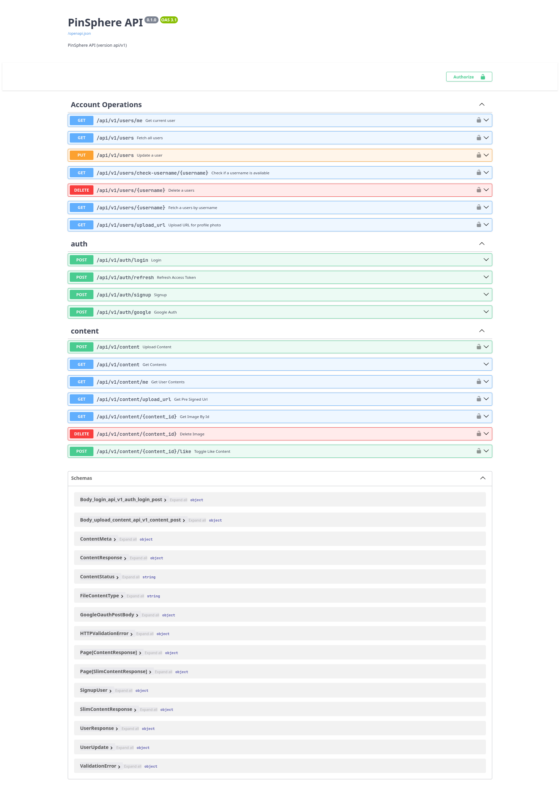
</div>

<br/>

### Core API Endpoints Summary

- **Authentication (`/api/v1/auth`)**:
  - `POST /login` - Issue access tokens via password credentials.
  - `POST /google` - Verify Google OAuth 2.0 tokens and authenticate/register users.
- **Content & Media (`/api/v1/content`)**:
  - `GET /upload_url` - Generate authenticated S3/MinIO pre-signed POST URL.
  - `POST /` - Finalize content registration and trigger Celery processing pipeline.
  - `GET /` - Retrieve paginated media pins with creator relations.
  - `GET /search` - Semantic natural-language search powered by pgvector.
  - `POST /{content_id}/like` - Toggle like status on a pin.
- **Comments (`/api/v1/comments`)**:
  - `POST /` - Post top-level or nested reply comments.
  - `GET /content/{content_id}` - Fetch hierarchical comment threads.
- **Users (`/api/v1/users`)**:
  - `GET /me` - Retrieve authenticated user profile and preferences.
  - `PUT /me` - Update user bio, avatar, and settings.

---

## 🚀 Local Quickstart & Development

### Prerequisites
- [Docker](https://www.docker.com/) & Docker Compose
- [Node.js](https://nodejs.org/) (v20+) & `npm`
- [Python](https://www.python.org/) (v3.12+) & [uv](https://github.com/astral-sh/uv) (for native backend execution)
- [Ollama](https://ollama.com/) (Optional: required for local vision inference with `gemma3:4b`)

---

### Option A: Complete Environment with Docker Compose (Recommended)

The easiest way to stand up the entire infrastructure (Postgres with pgvector, Redis, MinIO with automated bucket provisioning, FastAPI backend, and Celery worker):

1. **Clone the repository:**
   ```bash
   git clone https://github.com/saurabh254/PinSphere.git
   cd PinSphere
   ```

2. **Launch all infrastructure services:**
   ```bash
   cd server
   docker compose up --build -d
   ```
   *This initializes:*
   - **FastAPI Application**: `http://localhost:8000` (Docs at `/docs`)
   - **PostgreSQL 16 + pgvector**: `localhost:5432`
   - **MinIO S3 Storage**: `http://localhost:9000` (Console at `:9001`)
   - **Redis Service**: `localhost:6379`
   - **Celery Worker**: Connected to Redis broker

3. **Start the Frontend client:**
   ```bash
   cd ../webapp
   npm install
   npm run dev
   ```
   Access the web app at `http://localhost:5173`.

---

### Option B: Native Development Setup

#### Backend Setup
```bash
cd server

# 1. Install dependencies using uv
uv sync --dev

# 2. Configure environment variables
cp .env.example .env # or customize your .env with your PostgreSQL, Redis, and S3 credentials

# 3. Apply database migrations
uv run alembic upgrade head

# 4. Start background Celery worker
uv run celery -A celery_app.app worker --loglevel=INFO

# 5. Launch FastAPI development server
uv run uvicorn main:app --reload --port 8000
```

#### Frontend Setup
```bash
cd webapp

# 1. Install dependencies
npm install

# 2. Run development server
npm run dev

# 3. Type check & Lint
npm run type_check
npm run lint_check
```

---

## 📂 Repository Structure

```
PinSphere/
├── .github/
│   └── workflows/              # GitHub Actions CI for server and webapp lint/type check
├── public/                     # High-res screenshots, UI captures, and architecture assets
├── server/                     # Backend application service
│   ├── core/                   # Core business domain, models, database sessions & storage
│   │   ├── authflow/           # OAuth 2.0 and JWT token authentication logic
│   │   ├── database/           # Async/sync SQLAlchemy session managers and base models
│   │   ├── models/             # SQLAlchemy ORM models (Content, User, Comments, Vector)
│   │   ├── boto3_client.py     # AWS S3 / MinIO client wrapper
│   │   ├── embedding_generation.py # Ollama Vision & Sentence-Transformers pipeline
│   │   └── storage.py          # Pre-signed URL generator & storage utilities
│   ├── pin_sphere/             # FastAPI modular routing and application services
│   │   ├── auth/               # Authentication endpoints & schemas
│   │   ├── comments/           # Hierarchical comment endpoints & services
│   │   ├── content/            # Media upload, search & Celery task triggers
│   │   └── users/              # User management & profile handlers
│   ├── scripts/migrations/     # Alembic database migrations (pgvector schema)
│   ├── tests/                  # Unit and integration test suites (pytest)
│   ├── celery_app.py           # Celery application initialization
│   ├── docker-compose.yml      # Multi-container orchestration (MinIO, Postgres, Redis, App)
│   ├── Dockerfile              # Container definition for API and Worker
│   ├── main.py                 # FastAPI application entrypoint & middleware configuration
│   └── pyproject.toml          # uv package configuration and task definitions
└── webapp/                     # Modern React frontend application
    ├── public/                 # Static assets, SVG icons & logos
    └── src/
        ├── components/         # Modular React components (Masonry, Blurhash, UploadDropZone)
        ├── hooks/              # Custom React hooks (theme toggle, media queries)
        ├── pages/              # Routed view pages (Home, SearchContent, Profile, Login)
        ├── service/            # Axios API client & endpoint definitions
        └── types/              # TypeScript interfaces and data models
```

---

## 👨‍💻 Engineering Ownership & Contact

PinSphere was designed and developed from scratch by **Saurabh Vishwakarma**.

- **Author**: Saurabh Vishwakarma
- **Email**: [sauravvishwakarma030@gmail.com](mailto:sauravvishwakarma030@gmail.com)
- **GitHub**: [@saurabh254](https://github.com/saurabh254)

---

<div align="center">
  <sub>Built with engineering passion, clean architecture, and modern full-stack standards.</sub>
</div>

